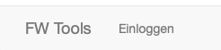

# BSW Benutzerhandbuch
Die BSW-Verwaltung ist im Wesentlichen eine Benutzeroberfläche zu den NextCloud Kalenderfunktionalitäten.
Diese Kalenderfunktionalitäten können genau so in der Kalender-App manuell durchgeführt werden. In der Oberfläche sind jedoch die Abläufe vereinfacht.

**Grundsätzlich können mit diesem Modul auch andere Ereignisse als Brandsicherheitswachen verwaltet werden. Z.B.: Einladung zu Veranstaltungen, Übungen, Lehrgängen u.a. ... 
Die Spezifika einer Brandsicherheitswache sind eigentlich nur die benötigte Anzahl der Teilnehmer (Bedarf), welche den Fluß des Ablaufs bestimmt. Aber auch Lehrgänge haben meistens eine Mindest-Teilnahme die wiederum in einem Ablauf einen Trigger setzt.**

## Allgemeine Funktionen
Nach dem Aufruf der URL für die Anwendung erhält der Benutzer am unteren Browser-Rand ein Menu:

Bei der Auwahl **Einloggen** wird der Benutzer nach seinen Login-daten gefragt:

Nach der erfolgreichen Anmeldung ändert sich das Menu am unteren Bildschirmrand und der Eintrag **BSW** kann angewählt werden. 

Die Menupunkte **Berichte** und **Profil ändern** sind aktuell nur Platzhalter. 
Der Menupunkt **Ausloggen** ist selbsterklärend.

Am oberen Bildschirmrand erscheint nun ein weiteres Menu:

* Unter **BSW eintragen** lässt sich eine neue Brandsicherheitswache in den NextCloud Kalender eintragen.
* Mit **BSW Management** lassen sich zukünftige Termine (Brandsicherheitswachen) einfach verwalten. Defaultmäßig werden Termine vom aktuellen Datum bis 12 Monate in die Zukunft ausgewählt.
* Mit **BSW Nachsorge** lassen sich vergangene Termine (Brandsicherheitswachen) abschliessen. Defaultmäßig werden Termine vom aktuellen Datum bis 12 Monate in die Vergangenheit ausgewählt.
* Im **Suchformular (rechts neben der Lupe)** kann auf ein spezifisches Datum gesprungen werden. Die Monatseingabe ermöglicht die Justage der darzustellenden Termine. Der Wert 0 zeigt nur die Termine des eingegebenen Datums an. 
	* Negative Eingaben nutzen die Funktion **BSW Nachsorge**
	* 0 oder positive Eingaben nutzen die Funktion **BSW Management**

## BSW eintragen
Unter **BSW eintragen** lässt sich eine neue Brandsicherheitswache in den NextCloud Kalender eintragen.

Die dargestellten Formulareinträge korrellieren mit den typischen Kalender-Einträgen.
Der Eintrag *Bedarf* ermöglicht die Eingabe einer Mindestanzahl an Teilnehmern für die Brandsicherheitswache (Veranstaltung).

Anfangs und Endzeit der Brandsicherheitswache wird in realen Veranstaltungszeiten angegeben. Die Feuerwehrspezifische Dienstanweisung wird die Rüstzeiten vor und nach der Veranstaltung bestimmen. Bei der **BSW Nachsorge** kann eine Excel-Liste mit den Daten der Veranstaltung und den Teilnehmern erzeugt werden, die diese Rüstzeiten ausweist. Als Rüstzeiten werden 1/2 Stunde vor und 1/2 Stunde nach der Veranstaltung ausgewiesen.

Nach der Erfassung wird im NextCloud-Kalender der Termin mit zusätzlichen Attributen angelegt.

* Kategorie "BSW-Anfrage" und "Bedarf=*Angegebener Bedarf*"
* Veranstaltung ist als *Vorläufig* deklariert
* Es sind noch **KEINE Teilnehmer** eingetragen
* Der aktuelle Benutzer ist als "Organisator" vermerkt
* Es sind Erinnerungen voreingestellt:

Die Pictogramme auf der rechten Seite der unten dargestellten Screenshots mit Teilnehmern sind mit Hilfsfunktion ausgestattet. Wird der Mauszeiger über das Pictogramm geführt, erscheint eine Erklärung für die Funktion der dazugehörigen Checkbox.

## BSW Management
Unter **BSW Management** lässt sich eine zukünftige Brandsicherheitswache verwalten.
Über die "Kategorie" des Kalendereintrags ergeben sich folgende Ablaufpunkte mit der entsprechenden Farbkennzeichnung.

* BSW-ANFRAGE (Farbe: gelb) bei einem neuen Termin
* BSW-FINALISIEREN (Farbe: rot) bei genügend Zusagen zum Termin
* BSW-ANFRAGE-ABGESCHLOSSEN (Farbe: grün) als manuelle Aktion des BSW-Verwalters mit der Festlegung der endgültigen Teilnehmer, der Reserve und der "Führung"

Der Titel des Termins ist als Hyperlink ausgestaltet. **Die Auswahl des Hyperlinks führt zu dem konkreten Termin im NextCloud-Kalender.**

### BSW-ANFRAGE
Nach dem Neueintrag eines Termins lassen sich im wesentlichen die Teilnehmer einladen und die Reaktion der Teilnehmer beobachten.

Grundsätzlich sind bläuliche Piktogramme ein Hinweis auf weitere Funktionen in dieser Oberfläche.
Die Anwahl des Personen-Piktogramm ermöglicht [die Teilnehmer zur Veranstaltung hinzuzufügen](#teilnehmer-hinzufuegen).

* Teilnehmer können in diesem Status manuell durch den Verwalter im Termin auf "Akzeptiert" gesetzt werden. 
* An einzelne Teilnehmer kann eine Email gesendet werden

Wenn genügend eingeladene Teilnehmer gemäß dem angegebenen Bedarf zugesagt haben, wechselt der Termin beim erneuten Aufruf des **BSW-MANAGEMENT** in den Status *BSW-FINALISIEREN*.

**ACHTUNG**: Es wird nur die Anzahl der akzeptierten Einladungen gezählt. Der Typ der Teilnahme wird nicht beachtet. Dieses hilft für Termine eine feste Reserve einzuplanen, indem der reale Teilnehmerbedarf um den Reservebedarf erhöht wird.

### BSW-FINALISIEREN

* Sind mehr akzeptierte Teilnehmer vorhanden als im Bedarf angegeben, können Teilnehmer als Reserve gekennzeichnet werden.
* An einzelne Teilnehmer kann eine Email gesendet werden.
* Durch Anwahl der Checkbox wird der Termin in den Status *BSW-ANFRAGE-ABGESCHLOSSEN* gesetzt.

### BSW-ANFRAGE-ABGESCHLOSSEN

Im Status *BSW-ANFRAGE-ABGESCHLOSSEN* können folgende Funktionen durchgeführt werden.

* Teilnehmer aus der Reserve herausholen
* Teilnehmer als "Führung" deklarieren
* Teilnehmer in die Reserve stellen
* An einzelne Teilnehmer kann eine Email gesendet werden
* Email an alle Teilnehmer senden

## BSW Nachsorge
Unter **BSW Nachsorge** lässt sich eine vergangene Brandsicherheitswache verwalten.
Über die "Kategorie" des Kalendereintrags ergeben sich folgende Ablaufpunkte mit der entsprechenden Farbkennzeichnung.

* BSW-DURCHGEFÜHRT (Farbe: blau) bei einem Termin in der Vergangenheit
* BSW-ABGERECHNET (Farbe: grau) wieder als manuelle Aktion des BSW-Verwalters

Der Titel des Termins ist als Hyperlink ausgestaltet. **Die Auswahl des Hyperlinks führt zu dem konkreten Termin im NextCloud-Kalender.**

### BSW-DURCHGEFÜHRT

Im Status *BSW-DURCHGEFÜHRT* können folgende Funktionen durchgeführt werden.

* Email an alle Teilnehmer senden
* An einzelne Teilnehmer kann eine Email gesendet werden
* Durch Anwahl der Checkbox wird der Termin in den Status *BSW-ABGERECHNET* gesetzt. Hierbei wird eine Excel-Liste heruntergeladen, die für diese BSW die Teilnehmer und Veranstaltungsdaten enthält.

Der Absendebutton wird deaktiviert und die Seite muss neu geladen werden.

Zusätzlich wird am Ende der BSW-Liste eine Statistik zu den Teilnehmern ausgegeben (bezogen auf den Zeitraum der dargestellten BSW, also im Default über die letzten 12 Monate).

## BSW-ABGERECHNET

Im Status *BSW-ABGERECHNET* können folgende Funktionen durchgeführt werden.

* An einzelne Teilnehmer kann eine Email gesendet werden

# Sonstige Informationen
Da der Status der Termine im NextCloud Kalender reflektiert wird, können auch alle Aktivitäten manuell dort durchgeführt werden. 
Die Statuswechsel werden innerhalb der Details an den Kategorien durchgeführt. 
Die Veränderung der Teilnehmer ist natürlich im Teilnehmer-Tab des Termins möglich. 
Auch die Erinnerungen lassen sich im Termin modifizieren.

## Teilnehmer hinzufügen
Bei der Auswahl *Teilnehmer hinzufügen* (Personen Piktogramm) werden die   im LDAP konfigurierten Listen und Gruppen dargestellt.

Durch Auswahl der Checkboxen werden die Mitglieder der ausgewählten Listen/Gruppen dem Termin zugeordnet. Sind Teilnehmer in mehreren Listen/Gruppen enthalten, werden diese nur **einmal** zugeordnet. Die Kalenderfunktion sorgt dann für eine Email-Einladung der Teilnehmer. Die Eindeutigkeit bezieht sich auf die Email-Adressen in Kombination mit dem Namen.

Der Name der Gruppierung ist als Hyperlink ausgestaltet, mit der Anwahl werden die Mitglieder dieser Gruppe/Liste aufgelistet.

Hier lassen sich dann einzelne Mitglieder auswählen und dem Termin zufügen.

Der Vorgang Teilnehmer hinzufügen lässt sich im Status **BSW-ANFRAGE** beliebig oft wiederholen. Die Eindeutigkeit der Zuordnung zum Termin wird beibehalten und bezieht sich auf die Email-Adressen in Kombination mit dem Namen.

